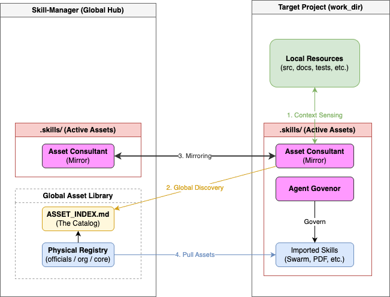

# Skill-Manager

**A management framework for unifying AI agent assets (skills, tools, and configurations) across organizations, streamlining the distribution and maintenance of official and internal skills.**

## 🌟 Vision

`Skill-Manager` abstracts and absorbs the subtle differences in directory structures and paths required by various AI agents (Gemini, Claude, Codex, etc.), providing an environment where **"users can use their preferred agent while seamlessly sharing and reusing organizational knowledge."**

## 🏗️ Architecture: Parallel & Connected Model

`Skill-Manager` connects local projects to a global asset repository through a parallel directory structure. The **Asset Consultant** is deployed in both the Hub and the Target Project to manage and synchronize assets and resources across the workspace.



### 🧠 Core Concepts

- **Parallel Structure**: The Hub (source) and Target Project (work_dir) reside on the same filesystem level, linked via configuration.
- **Dual-Resident Consultant**: The `Asset Consultant` operates in both environments, maintaining a synchronized view of global assets and local context.
- **On-Demand Importing**: Skills are selectively imported from the Hub's registry into the project's `.skills/` directory as needed.
- **Automated Governance**: The `Agent Governor` continuously audits the asset index and active deployments to ensure system integrity.

### 📂 Directory Structure (The Physical Bridge)

The relation between the Global Hub and your Local Project:

```text
{path}/{to}/{parent}/
├── skill-manager/                # 【Global Hub / Source】
│   ├── .skills/                  #
│   │   ├── ASSET_INDEX.md        # Master catalog for AI discovery
│   │   └── core-asset-consultant/# Intelligence Bridge (Source)
│   ├── core/
│   │   └── tools/                # Deployment tools (import_skill.py, setup_project.py)
│   ├── officials/                # Official skills from Google, Anthropic, etc.
│   └── org/                      # Internal common skills
│
└── my-target-project/            # 【Local Work / Destination】
    ├── .env                      # Contains SKILL_MANAGER_ROOT={absolute-hub-path}
    ├── PROJECT_RULES.md          # Project-specific common rules
    ├── AGENTS.md                 # 🔗 Link to PROJECT_RULES.md
    ├── CLAUDE.md                 # 🔗 Link to PROJECT_RULES.md
    ├── .skills/                  # Imported skill entities
    │   └── core-asset-consultant/ # The resident Intelligence Bridge
    ├── .agents/skills/           # 🔗 Link to .skills/ (for Gemini)
    └── .claude/skills/           # 🔗 Link to .skills/ (for Claude)
```

## 🚀 Getting Started (Bootstrap Workflow)

You can set up a target project in two steps from the `skill-manager` directory:

1.  **Prepare the Hub**:
    ```bash
    git clone --recursive {this-repo-url}
    cd skill-manager
    python3 core/tools/scan_assets.py
    ```

2.  **Initialize Target Project**:
    ```bash
    python3 core/tools/setup_project.py --repo {your-target-project-path} --name "My Project"
    ```
    *This will automatically configure `.env`, create the directory structure, and deploy the `Asset Consultant`.*

## ✨ Core Values
1.  **Anti-Fragmentation**: Absorbs subtle path differences through a symbolic link layer.
2.  **Maintenance-First**: Prioritizes structure and trust over complex UIs.
3.  **Collaborative Defense**: Curates certified official assets (Google, Anthropic, etc.) as submodules.

## 🛠️ Roadmap
- [x] **Bridge Architecture**: Dynamic link between Global Hub and Local Projects.
- [x] **Auto-Bootstrap**: Single-command setup for target projects.
- [ ] **Diagnostic Mode**: Strengthening `asset-consultant` to scan and suggest missing capabilities.
- [ ] **Global Sync**: Visualizing active capabilities across multiple projects via `ACTIVE_ASSETS.md`.

## 🏷️ Skill Naming Convention
`{source}-{repo_name}-{skill_name}` (e.g., `official-skills-anthropic-pdf-reader`)
