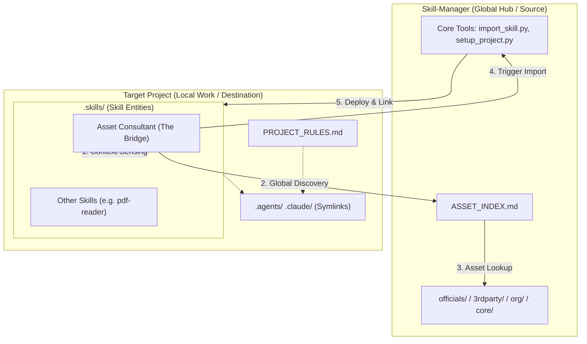

# 🏛️ Skill-Manager Architectural Design & Strategy

## 1. 核心的コンセプト: "The Bridge Architecture"
`Skill-Manager` は、膨大な資産を管理する **Global Hub (倉庫)** と、実際に作業を行う **Target Project (現場)** を繋ぐ知的な架け橋（Intelligence Bridge）として機能します。

### 3つのレイヤー構造
1.  **Global Hub (Source)**: `skill-manager` リポジトリ自体。公式・自社・サードパーティの資産（Skills/Tools）のマスターカタログを保持。
2.  **Target Project (Destination)**: ユーザーの作業リポジトリ。必要な資産だけをインポートし、軽量かつ最新の状態で維持。
3.  **Asset Consultant (The Bridge)**: 両方のコンテキストを把握し、現場に最適な資産をカタログから提案・デプロイする「知性」。

#### 📂 相互作用と構造 (Mental Model)



```text
{path}/{to}/{parent}/
├── skill-manager/                # 【Global Hub / Source】
│   ├── .skills/                  #
│   │   ├── ASSET_INDEX.md        # 全資産のマスターカタログ（AIの目）
│   │   └── core-asset-consultant/# 【Intelligence Bridge】の実体
│   │       └── SKILL.md          # 「故郷(Hub)と作業場(Target)の両方を見ろ」という命令書
│   ├── core/
│   │   └── tools/                #
│   │       ├── import-skill.py   # HubからTargetへコピーするツール
│   │       └── setup-project.py  # Targetの基本構造を整えるツール
│   ├── officials/                # 各社の公式スキル（マスター）
│   └── org/                      # 自社共通スキル（マスター）
│
└── my-target-project/            # 【Local Work / Destination】
    ├── PROJECT_RULES.md          # このプロジェクト固有の基本ルール
    ├── AGENTS.md                 # 🔗 PROJECT_RULES.md へのリンク
    ├── CLAUDE.md                 # 🔗 PROJECT_RULES.md へのリンク
    │
    ├── .skills/                  # 【実体：インポートされた資産】
    │   ├── core-asset-consultant/# ★現場に常駐するコンサルタントの実体
    │   │   └── SKILL.md          # 「Hubを見に行け」という命令が含まれている
    │   └── official-pdf-reader/  # Hubからインポートされた他のスキル
    │
    ├── .agents/                  # Gemini用インターフェース
    │   └── skills/               # 🔗 ../.skills へのリンク（ここでACを認識）
    │
    └── .claude/                  # Claude用インターフェース
        └── skills/               # 🔗 ../.skills へのリンク
```

## 2. 配置戦略: Bridge-Link Model
検討の結果、`Asset Consultant` スキルは **「ターゲットプロジェクトに常駐しつつ、Hubを遠隔参照する」** モデルを採用します。

-   **利点**: ユーザーは現場を離れることなく、常に Hub 側の最新カタログ（`ASSET_INDEX.md`）から資産を検索・導入できる。
-   **仕組み**: `Asset Consultant` は `SKILL_MANAGER_PATH` 環境変数（または設定ファイル）を通じて、自身の「故郷」の絶対パスを知り、そこへアクセスする。

## 3. 実装の担保メカニズム
「現場から倉庫が見えるか？」を以下の3段階で担保します。
1.  **Path Resolution**: `setup-project.py` 実行時に、Hub の絶対パスを作業用プロジェクトの設定（`.env` 等）に固定する。
2.  **Dual Scanning**: 
    -   **Local Scan**: 現場の技術スタック（言語、既存ツール）を診断。
    -   **Global Scan**: Hub の `ASSET_INDEX.md` を最新カタログとして読み取り。
3.  **Automated Deployment**: 提案された資産は、Hub 側の `import-skill.py` を呼び出すことで、現場へ即座にデプロイされる。

---

## 🛠️ TODO / Roadmap

### Phase 1: 接続基盤の構築 (Connectivity)
- [ ] **`setup-project.py` の拡張**: ターゲットプロジェクトに `SKILL_MANAGER_PATH` を含む `.env` または設定ファイルを生成する機能の追加。
- [ ] **環境変数の読み込み**: 各ツール（`import-skill.py` 等）が、自身の場所ではなく環境変数から Hub を特定できるように修正。

### Phase 2: 知性の強化 (Consultant Intelligence)
- [ ] **`asset-consultant` プロンプトの更新**:
    -   「カタログは `SKILL_MANAGER_PATH/ASSET_INDEX.md` から読み取れ」という命令の追加。
    -   ターゲットプロジェクトの `package.json` や `requirements.txt` を読み取って状況判断する命令の追加。
- [ ] **`scan-assets.py` の汎用化**: 任意のディレクトリを対象に資産・状況をスキャンできる引数の追加。

### Phase 3: 体験の磨き込み (User Experience)
- [ ] **`docs/architecture-overview.drawio.png` の生成**: XMLから画像を書き出し、READMEに配置。
- [ ] **インポート履歴の管理**: どのプロジェクトに何をデプロイしたかを Hub 側で把握する `ACTIVE_ASSETS.md` のグローバル同期。

---

## 📈 将来の展望
将来的には、`Skill-Manager` 自体がひとつの MCP サーバとして機能し、エージェントが「公式ストア」からアプリをインストールするように、自然言語でスキルを動的に拡張できる環境を目指します。
